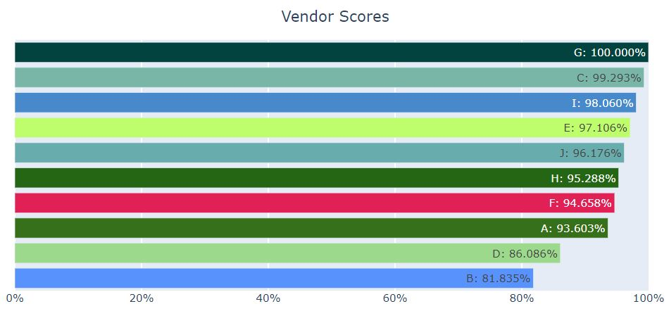

# SpaceX Preternship Project
Gavin Uhran ([gavinuhran](https://github.com/gavinuhran/)), Tom Henry ([tomkhenry](https://github.com/tomkhenry/)), Mike Prieto ([michaelpri10](https://github.com/michaelpri10/))

----
## Disclaimer
This project is not for the company SpaceX, but for an external industrial representative from SpaceX and University of Notre Dame alum whom we are partnering with.

----
## Overview
For the SpaceX Preternship Project, we worked with Ryan Green, an external industrial representative at SpaceX, to create the Vendor Analysis Dashboard. The dashboard collects vendor data from uploaded Excel files to provide data visualizations in Python for decreasing overhead and increasing leverage with suppliers. It runs on a Heroku server at http://vendor-analysis-app.herokuapp.com/ and utilizes the [Dash by Plotly](https://plotly.com/dash/) data visualization framework.

----
## Usage
1. **Web Address**
Access the Vendor Analysis Dashboard at http://vendor-analysis-app.herokuapp.com/

2. **Importing Files**
All import files MUST be an XLSX file. Additionally, all files must store data in the following columns:

|Vendor  |Days Past PO|Lot Size |Nonconforming Units|Units Downstream Failure|Cost (% Away from Target)|
|--------|------------|---------|-------------------|----------------|----------------|
|`vendor`|`integer`|`integer`|`integer`|`integer`|`percentage`|

  

3. **Adjusting Sliders**
Adjust the sliders to manipulate the weighted variables:
	* Days past PO, nonconforming units, units downstream failure, and cost away from target

  

4. **Vendor Comparisons**
Select 'Vendor Comparisons' from the tabs at the top of the page. From this tab, use the checklist to display the vendors you want to observe, and the dropdown to display compare the vendors performance in a specific category.
  

----
## Files
1. `include/`
	* **`dictionary_functions.py`**: Provides sorting and color hashing for the Vendor Dictionary
	* **`init_data.py`**: Imports data and reads into `Vendor.py` and `Order.py`
	* **`Order.py`**: Class for storing individual orders and calculating order scores
	* **`Vendor.py`**: Class for storing individual vendors and calculating vendor scores
	* **`xlsx_to_csv.py`**: Class for converting XLSX files to CSV files, and storing them in `data/`
2. `src/`
	* `assets/`
		* **`main.css`**: CSS styling for website
	* `tests/`
		* **`fake_data_upload_test.py`**: Test to ensure initial data import was functioning correctly
	* **`app.py`**: The application template, callback features, and deployment
3. **`requirements.txt`**: Python environment requirements
4. **`runtime.txt`**: Python version to run server on

----
## Running the Dashboard in Development
To run the application, you simply need to use the virtual environment that we have provided in this GitHub repository. In the main directory of the app, you should run in the command line:

    $ source venv/bin/activate
    $ python src/app.py

and then access the application at [http://127.0.0.1:8050/](http://127.0.0.1:8050/) in your browser.

To run this program without the virtual environment, you must install the following libraries using `pip`:

    $ pip install Flask dash==1.17.0 pandas plotly

And then you can run the app from the main directory of the app with:

    $ python src/app.py

----
## Instructions for pushing to Heroku
In order to push to Heroku, you must do first login to Heroku on the command line if you have not already:

    $ heroku login

Then you must add the Heroku URL as a remote repository:

    $ git remote add heroku https://git.heroku.com/vendor-analysis-app.git

You can then push to the application using:

    $ git push heroku master

----
## Benchmarking

| Feature       | # Orders      | Elapsed Time   | Speed          |
|---------------|---------------|----------------|----------------|
| Upload        | 100,000       | ~10 sec        |10,000 orders/s |
| Slider Change | 100,000       | ~1 sec         |100,000 orders/s|

*Note: we deleted this sample input file because of its size.*

----
## Known Issues
We wanted to highlight some known issues to prevent confusion about certain aspects of the program.

1. Invalid File Format - There is currently no indicator if a user has uploaded an invalid Excel file format (incorrect columns). The program should continue to be irresponsive until an Excel file with correct formatting is uploaded
----
